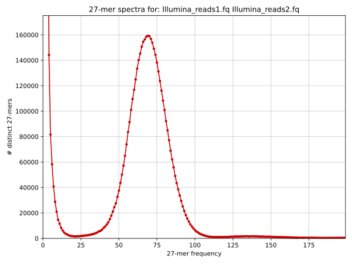
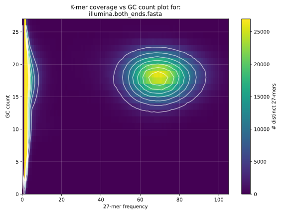

# TP1

## Table of contents
* [Genome assembly using PacBio HiFi reads](#Genome-assembly-using-PacBio-HiFi-reads)
* [Genome assembly using Nanopore reads](#Genome-assembly-using-Nanopore-reads)
* [Genome assembly using Illumina reads](#Genome-assembly-using-Illumina-reads)
* [Hybrid genome assembly](#Hybrid-genome-assembly)

## Genome assembly using PacBio HiFi reads

Reads available at [ERR9588941](https://www.ebi.ac.uk/ena/browser/view/ERR9588941).

### Preliminary analyses of HiFi reads

[KAT](https://github.com/TGAC/KAT)
```sh
kat hist -o kat_hist_hifi ERR9588941.fastq.gz 
kat gcp -o kat_gcp_hifi ERR9588941.fastq.gz 
```

 

### *De novo* assembly

[Flye](https://github.com/fenderglass/Flye) version 2.9
```sh
flye -o ERR9588941_flye_v29_default --pacbio-hifi ERR9588941.fastq.gz
cp ERR9588941_flye_v29_default/assembly.fasta ERR9588941.flye_v29_default.fasta 
```

[hifiasm](https://github.com/chhylp123/hifiasm) version 0.16
```sh
hifiasm -o ERR9588941.hifiasm_v016 ERR9588941.fastq.gz 
awk '$1 ~/S/ {print ">"$2"\n"$3}' ERR9588941.hifiasm_v016.bp.p_ctg.gfa > ERR9588941.hifiasm_v016.bp.p_ctg.fasta
```

[NextDenovo](https://github.com/Nextomics/NextDenovo) version 2.5
```sh
ls ERR9588941.fastq.gz > input.fofn
nextDenovo run.cfg
cp nextdenovo_v25_default_g14Mb/03.ctg_graph/nd.asm.fasta ERR9588941.nextdenovo_v25_g14m.fasta
```
```sh
[General]
job_type = local
job_prefix = nextDenovo
task = all
rewrite = yes
deltmp = yes
parallel_jobs = 10
input_type = raw
read_type = hifi # clr, ont, hifi
input_fofn = input.fofn
workdir = nextdenovo_v25_default_g14Mb

[correct_option]
read_cutoff = 1k
genome_size = 14m # estimated genome size
sort_options = -m 10g -t 4
minimap2_options_raw = -t 4
pa_correction = 5
correction_options = -p 30

[assemble_option]
minimap2_options_cns = -t 8
nextgraph_options = -a 1
```

### First assembly evaluation

**Flye**
```sh
raw_n50 ERR9588941.flye_v29_default.fasta 
```
```sh
contigs: 14 n50: 1667320 max: 3284869 mean: 967280 total length: 13541924 n80: 967713
```
**hifiasm**
```sh
raw_n50 ERR9588941.hifiasm_v016.bp.p_ctg.fasta 
```
```sh
contigs: 12 n50: 2863034 max: 3379096 mean: 1155766 total length: 13869199 n80: 2198374
```
**NextDenovo**
```sh
raw_n50 ERR9588941.nextdenovo_v25_g14Mb.fasta 
```
```sh
contigs: 12 n50: 2841658 max: 3387753 mean: 1150436 total length: 13805236 n80: 2135727
```

## Genome assembly using Nanopore reads

### *De novo* assembly

[Flye](https://github.com/fenderglass/Flye) version 2.9
```sh
flye -o mycobacterium_flye_v29_default --nano-raw ONT_reads.fa.gz
cp mycobacterium_flye_v29_default/assembly.fasta mycobacterium.flye_v29_default.fasta 
```

[minimap2](https://github.com/lh3/minimap2) version 2.24
[miniasm](https://github.com/lh3/miniasm) version 0.3
```sh
minimap2 -x ava-ont ONT_reads.fa.gz ONT_reads.fa.gz > ONT_reads_ava.paf
miniasm -f ONT_reads.fa.gz ONT_reads_ava.paf > mycobacterium.miniasm_v03_default.gfa
awk '$1 ~/S/ {print ">"$2"\n"$3}' mycobacterium.miniasm_v03_default.gfa > mycobacterium.miniasm_v03_default.fasta
```

[Raven](https://github.com/lbcb-sci/raven) version 1.8.1
```sh
raven --graphical-fragment-assembly mycobacterium.raven_v181_default.gfa ONT_reads.fa.gz > mycobacterium.raven_v181_default.fasta
```

[wtdbg2](https://github.com/ruanjue/wtdbg2) v2.5
```sh
wtdbg2.pl -o mycobacterium.wtdbg2_v25_g5Mb -t 20 -x ont -g 5m ONT_reads.fa.gz
cp mycobacterium.wtdbg2_v25_g5Mb.cns.fa mycobacterium.wtdbg2_v25_g5Mb.fasta
```

[NextDenovo](https://github.com/Nextomics/NextDenovo) version 2.5
```sh
ls ONT_reads.fa.gz > input.fofn
nextDenovo run.cfg
cp nextdenovo_v25_default_g5Mb/03.ctg_graph/nd.asm.fasta mycobacterium.nextdenovo_v25_g5Mb.fasta
```
```sh
[General]
job_type = local
job_prefix = nextDenovo
task = all
rewrite = yes
deltmp = yes
parallel_jobs = 10
input_type = raw
read_type = hifi # clr, ont, hifi
input_fofn = input.fofn
workdir = nextdenovo_v25_default_g14Mb

[correct_option]
read_cutoff = 1k
genome_size = 5m # estimated genome size
sort_options = -m 10g -t 4
minimap2_options_raw = -t 4
pa_correction = 5
correction_options = -p 30

[assemble_option]
minimap2_options_cns = -t 8
nextgraph_options = -a 1
```

### First assembly evaluation

**Flye**
```sh
raw_n50 mycobacterium.flye_v29_default.fasta 
```
```sh
contigs: 11 n50: 3371890 max: 3371890 mean: 459952 total length: 5059474 n80: 682062
```
**Raven**
```sh
raw_n50 mycobacterium.raven_v181_default.fasta 
```
```sh
contigs: 20 n50: 4677728 max: 4677728 mean: 343128 total length: 6862567 n80: 199089
```

**miniasm**
```sh
raw_n50 mycobacterium.miniasm_v03_default.fasta
```
```sh
contigs: 37 n50: 425382 max: 1418761 mean: 221828 total length: 8207657 n80: 109740
```

**wtdbg2**
```sh
raw_n50 mycobacterium.wtdbg2_v25_g5Mb
```
```sh
contigs: 46 n50: 722564 max: 2828282 mean: 134161 total length: 6171419 n80: 89441
```

## Genome assembly using Illumina reads

### Preliminary analysis of Illumina reads

```sh
kat hist -o kat_hist_illumina Illumina_reads1.fq Illumina_reads2.fq
kat gcp -o kat_gcp_illumina Illumina_reads1.fq Illumina_reads2.fq
```

 

### *De novo* assembly

[idba](https://github.com/loneknightpy/idba) version 1.1.3
```sh
fq2fa --merge Illumina_reads1.fq Illumina_reads2.fq illumina.both_ends.fasta
idba -o idba_out -l illumina.both_ends.fasta
cp idba_out/contig.fa mycobacterium.idba_v113_default.fasta
```

[Megahit](https://github.com/voutcn/megahit) version 1.2.9 
```sh
megahit -1 Illumina_reads1.fq -2 Illumina_reads2.fq -o megahit_out
cp megahit_out/final.contigs.fa mycobacterium.megahit_v129_default.fasta
```

### First assembly evaluation

**idba**
```sh
raw_n50 mycobacterium.idba_v113_default.fasta
```
```sh
contigs: 1416 n50: 18737 max: 85196 mean: 3647 total length: 5165068 n80: 4952
```

**Megahit** 
```sh
raw_n50 mycobacterium.megahit_v129_default.fasta
```
```sh
contigs: 1016 n50: 43205 max: 214758 mean: 5303 total length: 5388745 n80: 12779
```

## Hybrid genome assembly

### *De novo* assembly

[Unicycler](https://github.com/rrwick/Unicycler) version 0.5.0 
```sh
unicycler-runner.py -1 Illumina_reads1.fq -2 Illumina_reads2.fq -l ONT_reads.fa.gz -o unicycler_out
cp unicycler_out/assembly.fasta mycobacterium.unicycler_v050_default.fasta
```

### First assembly evaluation 

**Unicycler**
```sh
raw_n50 mycobacterium.unicycler_v050_default.fasta
```
```sh
contigs: 74 n50: 4702348 max: 4702348 mean: 67917 total length: 5025899 n80: 4702348
```
